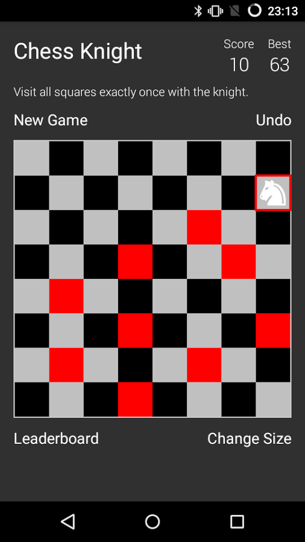

# Chess Knight
Chess Knight is a Android puzzle application available in the Play Store : https://play.google.com/store/apps/details?id=fr.forexperts.cavalier&hl=en.

Using knight's moves, visit all squares of the chessboard ! Can you do it ?



## HOW TO PLAY
Even if you are not a chess player, Chess Knight is pretty simple. Choose the selected square with your finger to move the knight. The complete knight move looks like the letter L.

## FEATURES
With the app, you can:

+ Game is automatically autosaved
+ Modify the size of the chessboard from 4x4 to 16x16
+ Leaderboards & Achievements
+ Keep playing for High-score after successful game, banned boxes appear
+ Game supports all android 4.1+ and above devices
+ Frequent game improvements based on your feedback

## PRESS
Recommended on Twitter by the French Chess Federation : https://twitter.com/ffechecs/status/617305600737865728

Reviews:
+ Android Headlines: http://www.androidheadlines.com/2015/07/sponsored-game-review-chess-knight.html
+ Mobile Startupz : http://mobilestartupz.com/2015/07/04/chess-knight-robert-baptiste/
+ Androidtechtips : http://www.androidtechtips.net/applications/chess-knight-game-review/

Videos : https://www.youtube.com/watch?v=PMNVpfTBmLg

## Copyright

```
Copyright 2015 Forexperts All rights reserved.

Licensed under the Apache License, Version 2.0 (the "License");
you may not use this file except in compliance with the License.
You may obtain a copy of the License at

    http://www.apache.org/licenses/LICENSE-2.0

Unless required by applicable law or agreed to in writing, software
distributed under the License is distributed on an "AS IS" BASIS,
WITHOUT WARRANTIES OR CONDITIONS OF ANY KIND, either express or implied.
See the License for the specific language governing permissions and
limitations under the License.
```
